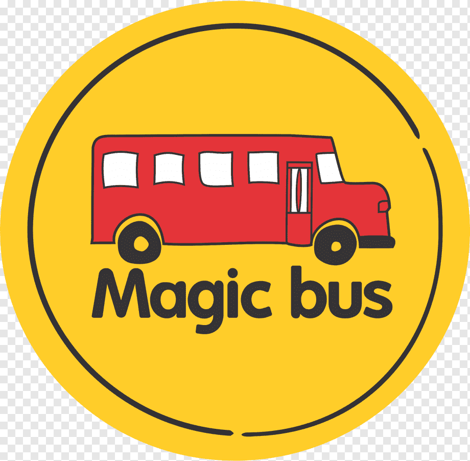

# 🌐 Magic Bus Static Website

This project is a **static website** designed to showcase a collection of themed web pages using HTML, CSS. The project was developed as part of an initiative with **Magic Bus India Foundation**, and it has been successfully deployed on the **Microsoft Azure** cloud platform.

## 📁 Project Structure

- `index.html` – The main HTML file containing all static sections: Home, Technologies, Diwali Products, Happy Meals, and News.
- `style.css` – Custom stylesheet used for styling the components and layout.
- `mbus-logo.png` – Magic Bus logo used in the homepage.

## 🛠️ Technologies Used

- HTML5
- CSS3
- Azure App Services for deployment

## 📸 Screenshots

| Home Page | Section Sample |
|-----------|----------------|
|  | *Includes sections like Advanced Technologies, Diwali Offers, Food Ordering, and News* |

